# External Course Completion

This material contains the results of completing the external course "Introduction to Linux". While completing the assignments, I consistently studied basic and more advanced features of the Linux operating system: working with the terminal, files and directories, standard input and output streams, remote servers, multithreaded applications, the `tmux` terminal manager, the `vim` editor, `bash` scripts, search and text-processing utilities, and tools for managing access permissions.

# Stage 1. Introduction

## General Course Information

I specified the course title, "Introduction to Linux".

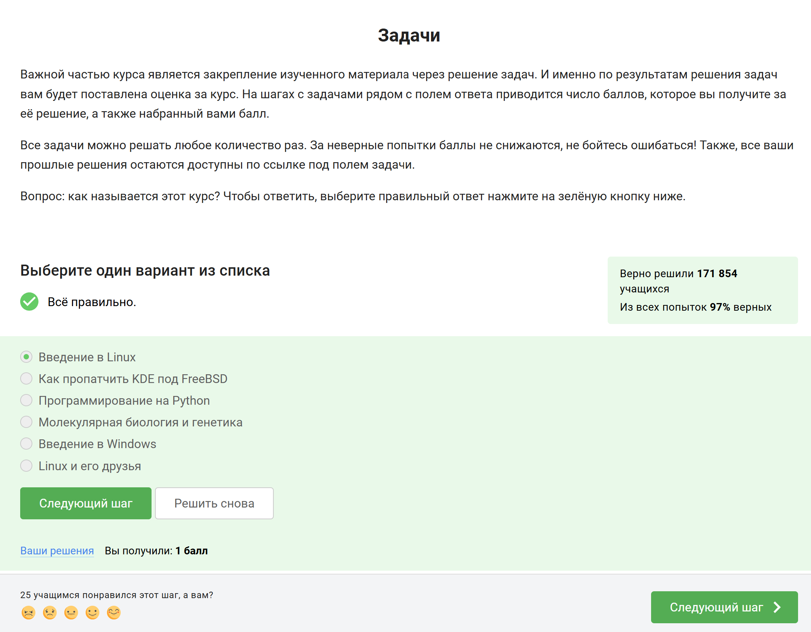

The task required choosing the course title from the provided options, which I did.

I read the course completion rules and selected all correct statements.

I selected the statements about completing assignments independently, the prohibition on publishing solutions, and the absence of deadlines.

## How to Install Linux

I indicated which operating systems I usually use and selected "Linux" and "Windows".

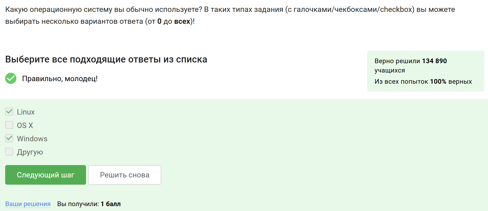

The task required selecting all suitable answers about which operating systems I usually use. I selected "Linux" and "Windows".

I indicated that a virtual machine is a special program for running one operating system inside another.

The task required choosing one correct answer about what a virtual machine is. I selected the option about running one OS on another OS.

I confirmed that Linux had been launched on the computer.

The task required confirming that Linux had been launched on the computer. Since the system had already been successfully launched on my computer for a long time, I selected "Yes".

## Getting Started with Linux

I created a text document in LibreOffice Writer, entered the line `Hello, Linux!`, saved the file in the required format, and uploaded it to the system.

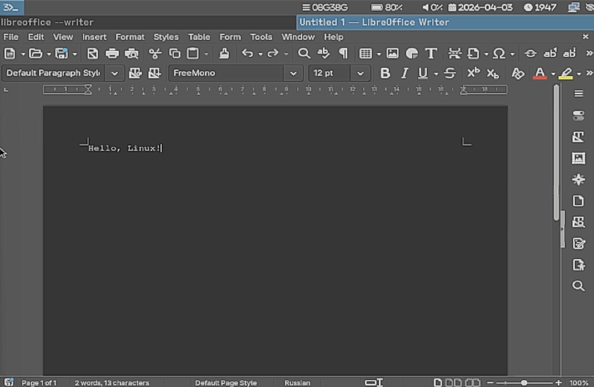

To complete the task, I prepared a document containing the line `Hello, Linux!`, saved it in the required format, and uploaded it successfully, which was confirmed by the accepted solution.

I indicated that Ubuntu installation packages have the `deb` extension.

The task required choosing the extension used by installation packages in Ubuntu. I considered the proposed options: `exe` mainly belongs to Windows, `dmg` belongs to macOS, and `txt` and `ubuntu` are not installation package formats. Therefore, I selected `deb`, which is used in Debian-family systems.

I installed the VLC media player, opened the window with information about the program, found the first surname in the Authors tab, and entered the answer into the system.

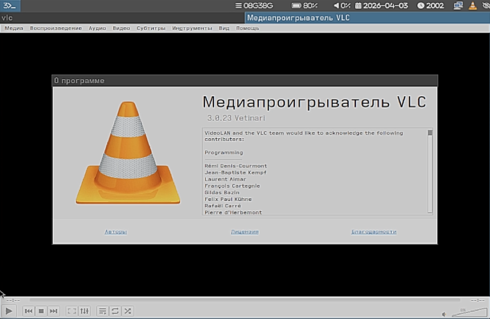

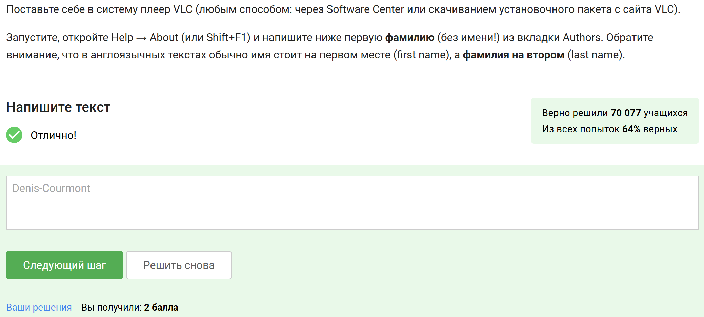

The task required installing VLC, opening `Help -> About`, and viewing the Authors tab. Since the author list first shows a first name and then a surname, I identified the first surname, `Denis-Courmont`, entered it into the platform field, and the system accepted the answer.

I indicated that Update Manager can be used to update Software Center links, update installed software, and upgrade the system to a new version.

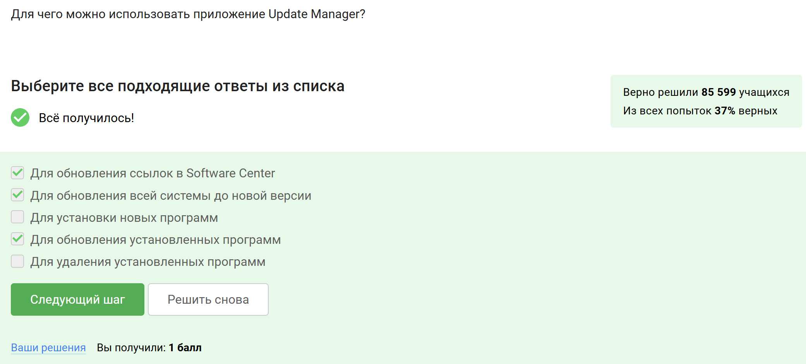

The task required selecting all suitable uses of Update Manager. I excluded the options about installing and removing programs, because other package-management tools are usually used for that. The remaining options were related to updating the system and programs, so I selected them.

## Terminal: Basics

I noted that "Terminal" and "Console" are synonyms for the command line.

The task required selecting all suitable names for the command line. The options "Assol" and "Termin" are not related to Linux work, so I excluded them. The suitable options are "Terminal" and "Console", because these words are commonly used for the interface where commands are entered.

I indicated that the `pwd` command prints the current directory.

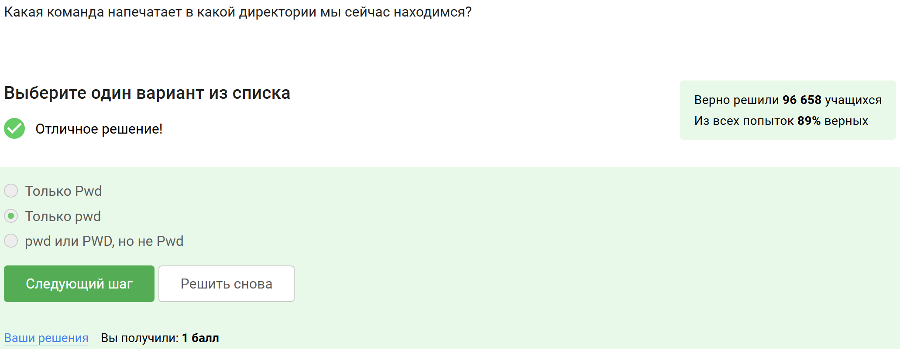

The task required choosing the correct spelling of the command that shows which directory the user is in. In Linux, command names are case-sensitive, so `Pwd` and `PWD` are not suitable. For this reason, I selected `pwd`.

I indicated that the command `ls -A --human-readable -l /some/directory` is fully equivalent to `ls -lAh /some/directory`.

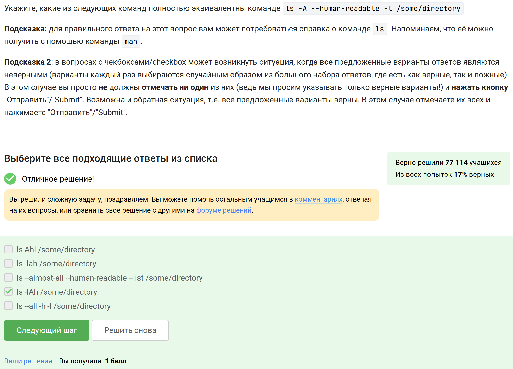

The task required finding the fully equivalent form of the `ls` command with the same parameters. I matched the long and short options: `-A` prints almost all files except `.` and `..`, `--human-readable` corresponds to `-h`, and `-l` enables long listing format. Therefore, I selected `ls -lAh /some/directory`, because it contains the same set of options in short form.

I indicated that the contents of `/home/bi/Downloads` can be printed with `ls ../Downloads` and `ls ~/Downloads` in the given situation.

The task required identifying commands that, from `/home/bi/Documents`, would show the contents of `/home/bi/Downloads` without touching other directories. The command `ls ../Downloads` is suitable because `Downloads` is one level above `Documents`. The command `ls ~/Downloads` is also suitable because `~` points to the home directory `/home/bi`. The option `ls Downloads` is not suitable because there is no such folder in the current `Documents` directory, and `ls /home/bi/Do*` addresses paths that begin with `Do`, not specifically the `Downloads` directory.

I indicated that directories are removed with the `rm -r` command.

The task required choosing the command that removes directories. The option `mkdir -r` is not suitable because `mkdir` creates directories, and `mv` moves or renames files and folders. The option `rm -f` is intended for forced file removal, but by itself it does not remove directories. Therefore, I selected `rm -r`, where `-r` means recursive removal of a directory together with its contents.

## Running Executable Files

I indicated that after entering the commands `firefox` and then `exit`, nothing will close.

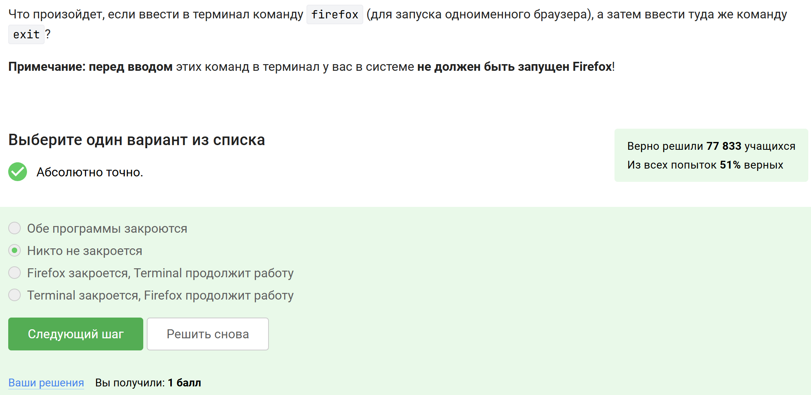

The task required determining what would happen when Firefox is launched from the terminal and `exit` is entered afterward. After launching the browser, the terminal usually waits for that program to finish, so `exit` does not immediately close the terminal window and does not close Firefox. For this reason, I selected the option that nothing will close.

I indicated that launching a program with `&` is equivalent to the sequence: launch the program, press `Ctrl+Z`, then run `bg`.

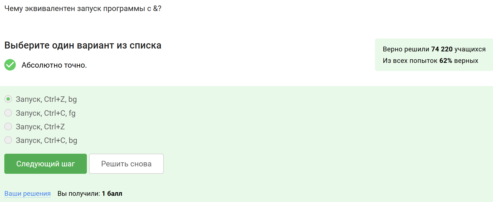

The task required determining what launching a command with `&` corresponds to. Such a launch immediately puts the process into the background. The same result can be achieved by starting the program normally, suspending it with `Ctrl+Z`, and then continuing it in the background with `bg`. Therefore, I selected that option.

I downloaded a program file, moved to its directory, and ran it, receiving the date, time, and checksum on the screen. Then I copied the output into the answer form on the platform.

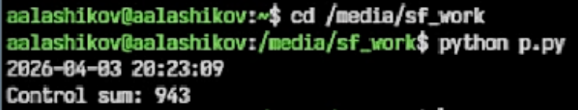

The task required downloading a program file, making it executable, and running it. After launch, the program printed output in the terminal, which I transferred into the answer field. The match between the printed text and the entered answer confirmed that the task was completed correctly.

## Input / Output

I indicated that by default, the error stream of a program launched in the terminal is displayed on the screen.

The task required determining where the error stream goes by default. The options with files named `stderr` and `err.txt` are not suitable, because errors are written there only when special redirection is used. The option "Nowhere" is also incorrect, because error messages are displayed to the user. Therefore, I selected "On the screen".

I indicated that the error stream of the program `program` can be written to `file.txt` with the commands `program 2>> file.txt` and `program 2> file.txt`.

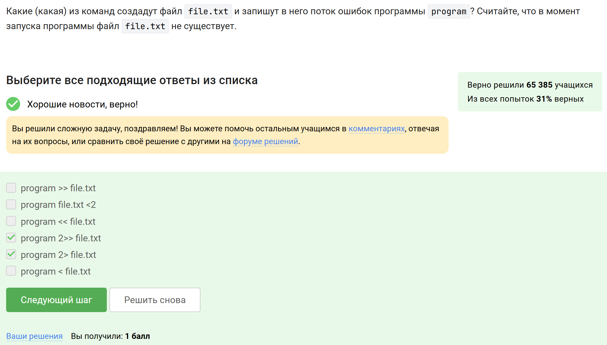

The task required selecting commands that would create `file.txt` and send exactly the error stream into it. The notation `2>` is used to redirect the standard error stream, and `2>>` appends errors to the end of the file. Since the condition states that the file does not exist yet, both commands are suitable because the file will be created. The other options either work with normal output or refer to input rather than the error stream.

I indicated that error messages from programs in a pipeline are displayed on the screen by default.

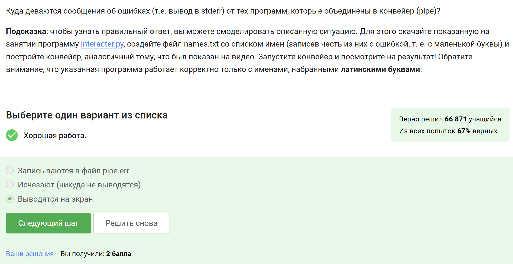

The task required determining where `stderr` goes when programs are connected through a pipeline. A pipeline passes only normal output, `stdout`, further along, while the error stream is not automatically merged with it. Therefore, error messages do not disappear and are not written to a separate file automatically; they continue to be displayed on the screen.

## Downloading Files from the Internet

I indicated that after executing the given commands, the image would be located in `/home/alex/1.jpg`.

The task required determining exactly where the file would be saved. The option `-O 1.jpg` sets the output filename, and `cd /home/alex/` changes into the user's home directory before that. Therefore, the file is saved as `/home/alex/1.jpg`. The option `-P /home/alex/Pictures` does not affect the final filename here because the name is explicitly specified with `-O`.

I indicated that the `-q` or `--quiet` option is used in `wget` to disable all on-screen messages.

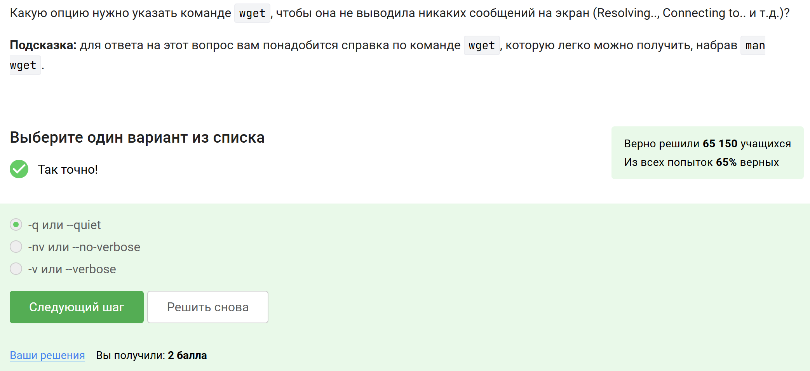

The task required choosing the option that prevents `wget` from printing service messages such as `Resolving` and `Connecting to`. The option `-v` does the opposite and enables verbose output, while `-nv` only reduces the number of messages but does not disable them completely. Therefore, I selected `-q` or `--quiet`, which makes the command quiet.

I indicated that when running `wget -r -l 1 -A jpg`, `jpg` and `html` files will be downloaded, but all `html` files will then be removed.

The task required determining which files remain after recursively downloading a page with an extension restriction. With this command, `wget` still downloads HTML pages because they are needed to follow links, but after completion it removes them if they do not satisfy the `-A jpg` condition. Therefore, only `jpg` files remain in the end, while `html` files are downloaded temporarily and then deleted.

## Working with Archives

I indicated that `gzip` removes an archive after extracting it.

The task required identifying the difference between `gzip` and `zip` when used without additional options. The options about compression ratio are not suitable, because that depends on the data and is not the main difference in this question. It is also incorrect that `zip` removes the archive after extraction. The feature of `gzip` is that during normal extraction the source `.gz` file is removed, so I selected that option.

I indicated that `zip` and `tar` can create an archive from a directory with files.

The task required selecting programs that can pack an entire directory. `zip` and `tar` are suitable because they are used to create archives containing directories and their contents. `gzip` is not suitable because by itself it usually compresses a single file rather than creating an archive from a directory.

I indicated that to create the archive `my_archive.tar.bz2` with `tar`, the option set `-cjf` should be used.

The task required choosing options for packing files into a `tar.bz2` archive. The key `c` means creating a new archive, `j` means compression with `bzip2`, and `f` means specifying the archive filename. The other options are not suitable because `z` is used for `gzip`, and `x` is for extraction rather than archive creation.

## Searching for Files and Words in Files

I indicated that the file `Alexey.jpeg` will not be found by the masks `*.?`, `alexey.*`, and `*.jpg`.

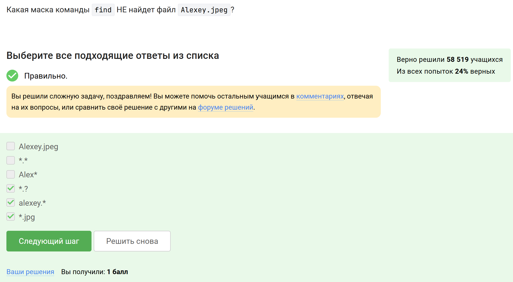

The task required selecting masks that do not match the file `Alexey.jpeg`. The mask `*.?` is not suitable because after the dot the filename has four characters, `jpeg`, not one. The mask `alexey.*` also will not match because the filename begins with uppercase `A`, and the search is case-sensitive. The mask `*.jpg` is not suitable because the extension is `jpeg`, not `jpg`.

I indicated the lines that contain the substring `world` and therefore will be printed by `grep "world" text.txt`.

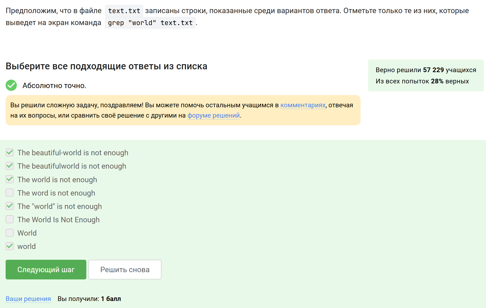

The task required selecting all lines where the exact sequence of characters `world` occurs. Therefore, the suitable lines are those where `world` appears as a separate word, as part of another word, or inside quotation marks. The options `The word is not enough`, `The World Is Not Enough`, and `World` were not suitable because `word` is a different sequence of letters, and `World` with an uppercase letter does not match the search string because `grep` without additional options is case-sensitive.

I downloaded an archive with Shakespeare's works, searched for all lines containing `love`, and saved the result to `answer.txt`. Then I uploaded the resulting file to the platform.

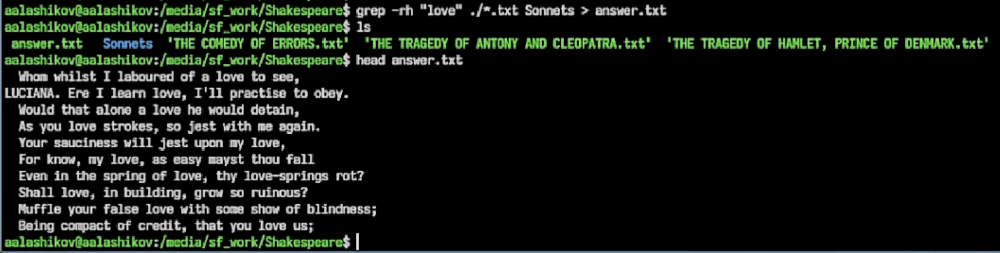

The task required obtaining a file with all lines from Shakespeare's works containing the word `love`. For this, I used a search through text files with output redirection to `answer.txt`. After checking the contents, I uploaded the resulting file to the form, and the system accepted the solution.

# Stage 2. Working on a Server

## Getting to Know the Server

I indicated that a remote server can be used to store public and confidential data, store large amounts of information, and perform complex computations.

The task required selecting all suitable uses of a remote server. I selected all listed items, because a server can indeed be used both for data storage and for computational tasks.

I indicated that the public key `id_rsa.pub` can be sent over the internet safely.

The task required determining which key from an `ssh-keygen` key pair can be shared with other users. It is safe to share the public key `id_rsa.pub`, while the private key `id_rsa` must remain only with the owner.

## File Exchange

I indicated that the command `scp -r stepic username@server:~/` is suitable for copying the `stepic` directory to a server together with all its contents and subdirectories.

This task required choosing the correct command for recursively copying a directory to a server. The suitable command is `scp -r`, because the `-r` option is responsible for transferring a directory together with all nested files and folders.

I indicated that problems when installing a program with `sudo apt-get install program` can be fixed by checking the internet connection, configuring it if it is unavailable, and running `sudo apt-get update`.

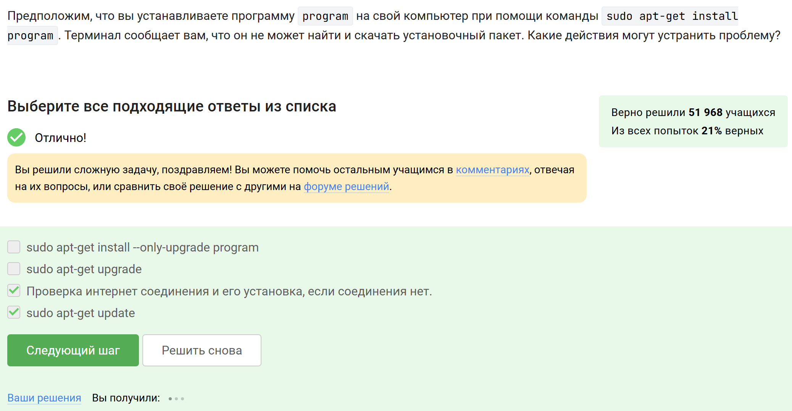

If a package cannot be found or downloaded, the first step is to check network access, then restore the connection if necessary, and update package information with `sudo apt-get update`. These are the actions I selected.

I indicated that FileZilla can be used to view directory contents on the local computer and on the server, and also to copy files from the server to the computer.

The task required selecting FileZilla functions. This program is indeed designed for working with files and directories on the local and remote sides, and for transferring files between them.

## Launching Applications

I indicated that if a program requiring a screen must be launched on a server, it is possible either to find a terminal version of the program or to configure the server to support graphical output.

The task considered a situation where a program requires a graphical interface. The most reasonable options are to use a console version of the application or configure graphical output from the remote server.

I indicated that reference information for a program named `program` can usually be obtained with `program --help` and `man program`.

For most Linux programs, short help is displayed through the `--help` parameter, and more complete documentation is available through `man`. Therefore, I selected these options.

I studied the help for FastQC and indicated that it can accept the input formats `fastq`, `bam_mapped`, `sam_mapped`, `bam`, and `sam`.

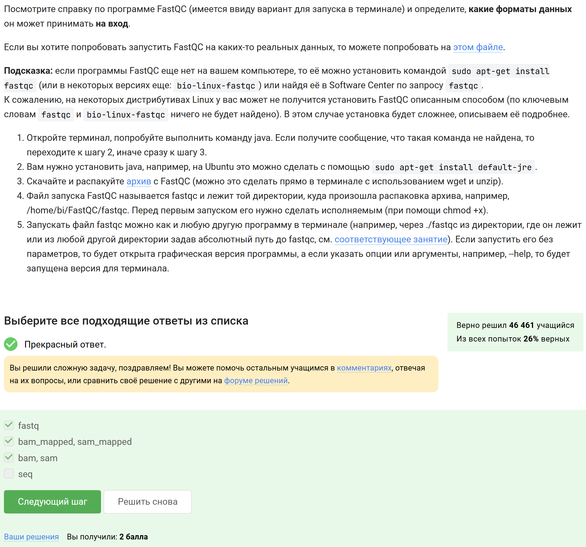

This task required reviewing FastQC help and determining the supported data formats. Based on the documentation, I selected the formats related to reads and alignments that the program can analyze.

I studied the help for ClustalW and entered the command `clustalw -align -infile=test.fasta` to perform multiple alignment of the `test.fasta` file.

The task required not just launching the program, but specifying the minimum required command that explicitly performs multiple alignment. For this, I used the `-align` option and specified the input file through `-infile`.

## Controlling Running Programs

I indicated that after the sequence `fg %1`, `Ctrl+C`, `fg %2`, `Ctrl+Z`, `jobs`, information will be shown only about `program2` and `program3`.

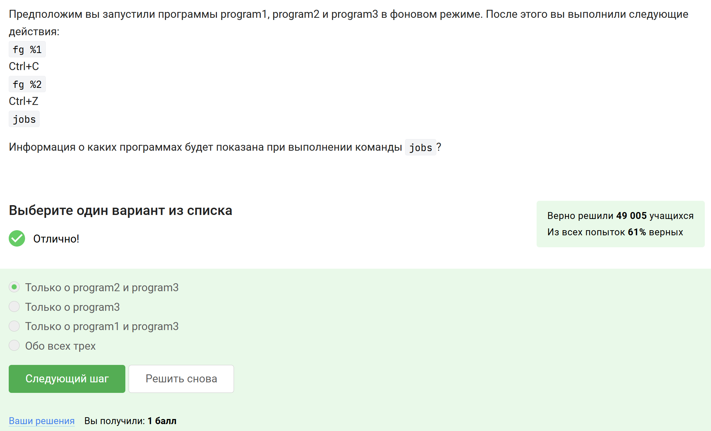

After `Ctrl+C`, the first program terminates and no longer belongs to the shell's job list. The second program becomes suspended after `Ctrl+Z`, and the third remains in the background, so `jobs` will show only `program2` and `program3`.

I indicated that identifiers in `jobs`, `top`, and `ps` differ.

The task compared identifiers shown by different utilities. `jobs` uses shell job numbers, while `top` and `ps` work with process IDs, so the values do not match.

I indicated that a stopped process can be terminated instantly with `kill -9`.

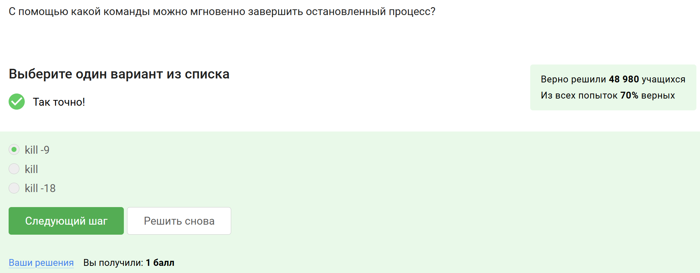

Signal `-9` corresponds to forced process termination. Therefore, I selected this option as the correct one.

I indicated that using `kill` without options on a process stopped with `Ctrl+Z` will cause the process to terminate.

By default, `kill` sends a termination signal. Even if the process was previously stopped, after receiving such a signal it exits.

## Multithreaded Applications

I indicated that a multithreaded application stopped with `Ctrl+Z` uses `0% CPU`.

After a process is stopped, instruction execution stops, so CPU time is no longer consumed. That is why I selected `0% CPU`.

I indicated that a stopped multithreaded application continues to occupy the same amount of memory that it used at the moment it was stopped.

Stopping a process does not automatically free the memory it has already occupied. While the process has not exited, its address space is preserved, so the amount of memory remains the same.

I indicated that a single separate thread of a running multithreaded application cannot be forcibly terminated.

The task considered ordinary Linux command-line work. Standard tools such as `kill` manage the entire process rather than a separate thread, so I selected the option that this cannot be done.

I studied the help for `bowtie2` and determined that only the second stage can be run in multiple threads, namely `bowtie2`, not `bowtie2-build`.

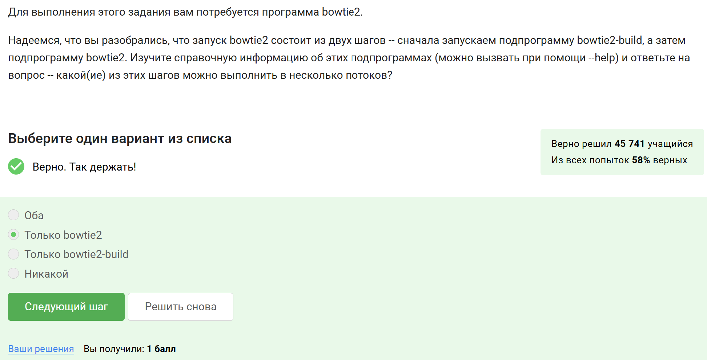

This task required checking the parameters of two subprocesses and determining where multithreading is available. Support for multiple threads exists specifically in `bowtie2`.

I completed the practical task with `bowtie2`: I launched the second stage of the program, redirected the error stream to `align.err`, and checked its contents in the terminal.

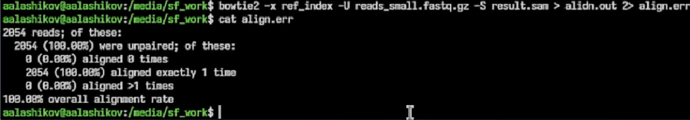

The screenshot shows the `bowtie2` launch command with `stderr` redirected to a separate file, followed by printing the file contents with `cat`. This confirms correct use of stream redirection.

After completing the task, I uploaded the resulting `align.err` file to the platform, and the system accepted it as the correct solution.

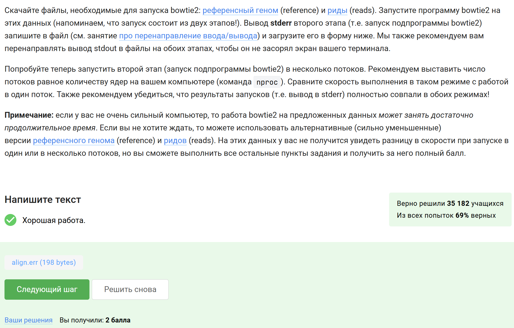

The task required not only creating the file with error output, but also uploading it to the verification form. The file was successfully attached and accepted.

## The tmux Terminal Manager

I indicated that if two terminal tabs are opened, a process is stopped in one of them, then I switch to the second one and run `fg`, the terminal will report that there is no process to start with `fg`.

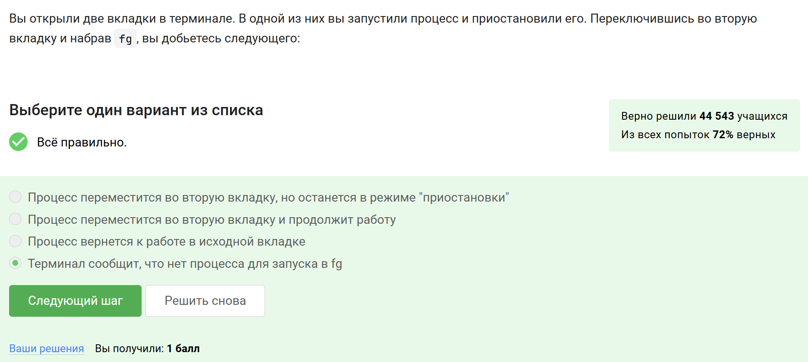

The `fg` command works only with jobs of the current shell. In the second tab, this job does not exist, so the shell reports that there is no process to bring to the foreground.

I indicated that if the last open tab remains in `tmux` and the `exit` command is run in it, `tmux` will terminate.

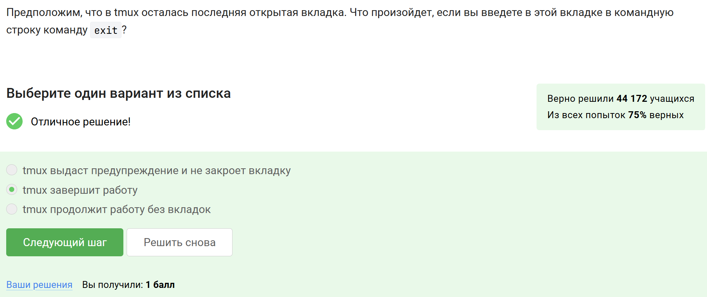

When the last active tab or window is closed, the `tmux` session itself also ends. Therefore, I selected this option.

I indicated that if `tmux` is launched on a server and then the local terminal is closed, the connection to the server will be interrupted, but `tmux` will continue running.

The point of `tmux` is that the session continues to exist on the remote machine independently of the current user connection. After logging in again, the user can reattach to it.

I indicated that if a process is launched in the background inside a `tmux` tab and then that tab is forcibly closed, the tab will close together with the process running inside it.

The task considered closing a `tmux` window. When a window is closed, the processes associated with it also terminate unless another way to keep them running was arranged.

I studied `tmux` commands and indicated that renaming the current tab is done with `Ctrl+B`, then `,`.

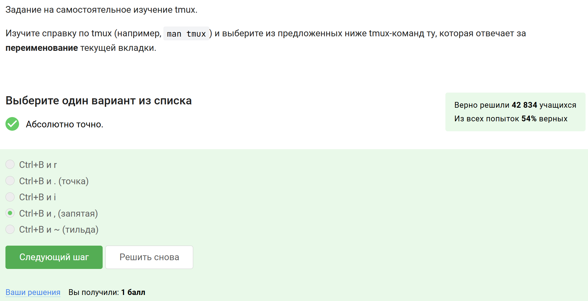

This is the standard `tmux` key sequence for changing the name of the current window, so I selected the option with the comma.

While independently studying `tmux` features, I selected the correct statements about splitting tabs: one part can be closed with `Ctrl+B`, then `x`; the window can be split several times; split commands apply only to the current tab; and if an already horizontally split tab is split vertically once more, three panes are created.

In this task, I had to independently check how pane splitting works in `tmux`. Based on the results, I selected the statements that match the actual behavior of the program when splitting and closing panes.

# Stage 3. Advanced Topics

## The vim Text Editor

I indicated that to exit `vim` immediately after opening a file, it is necessary to press `:`, then `q`, then `Enter`.

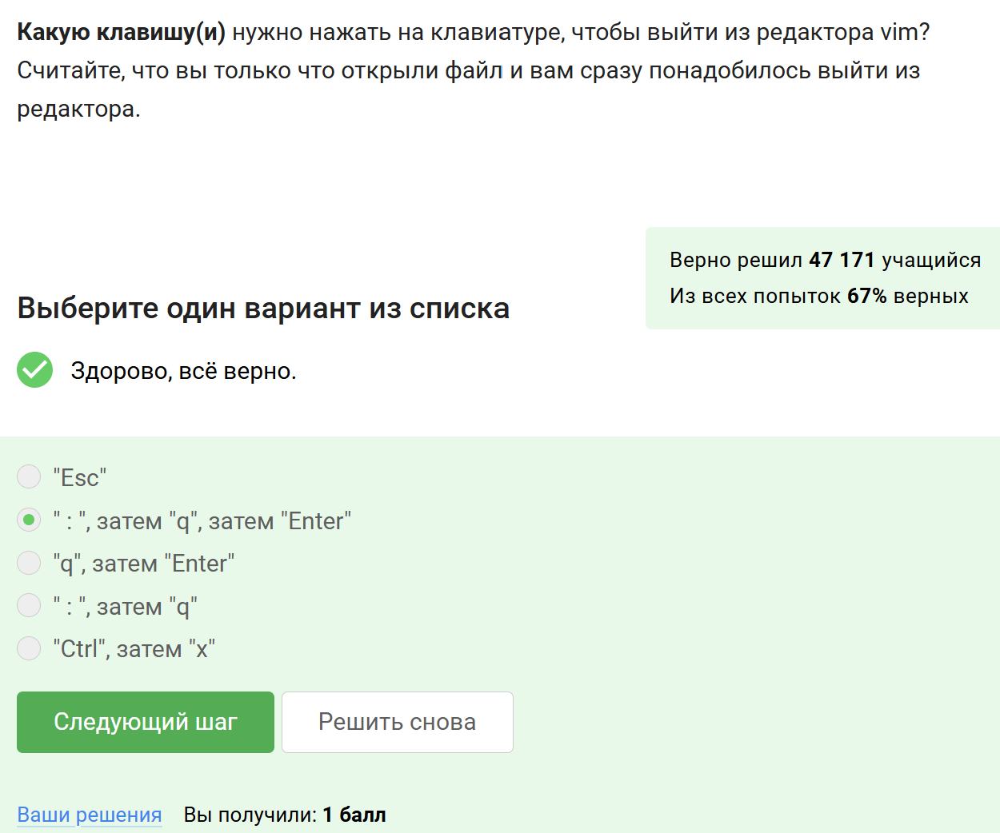

The task required determining the correct sequence for exiting `vim` if the file has just been opened and no changes have been made. The correct option is the `:q` command, which exits the editor.

I studied the difference between moving by `word` and `WORD` in `vim` and selected the correct statements for the given line.

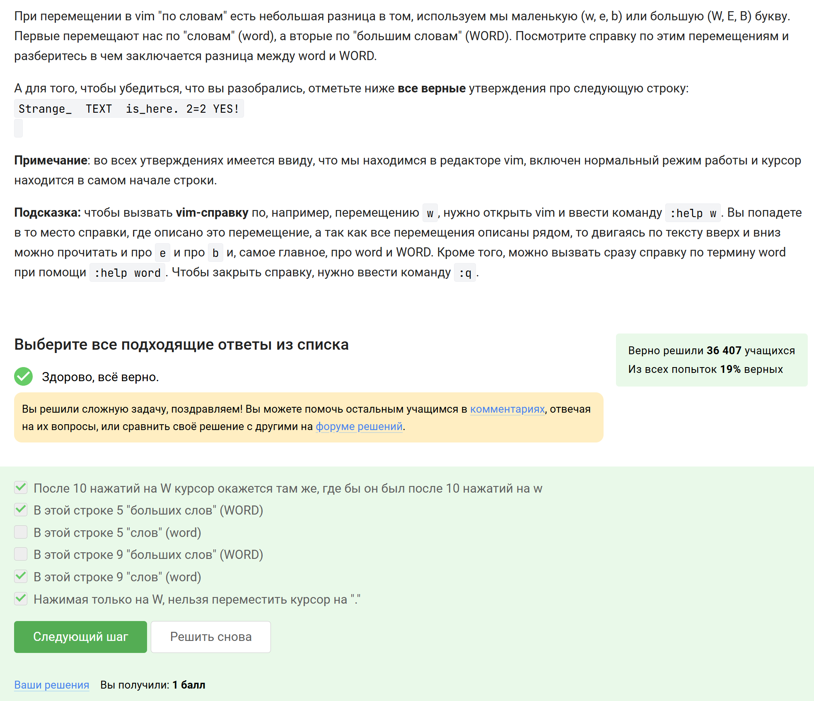

This task required understanding that commands with lowercase letters work with words in the usual sense, while commands with uppercase letters work with sequences of characters up to a space separator. Therefore, I selected only the statements that match this difference.

I determined the correct key sequences that transform the line `one two three four five` into `three four four four five`.

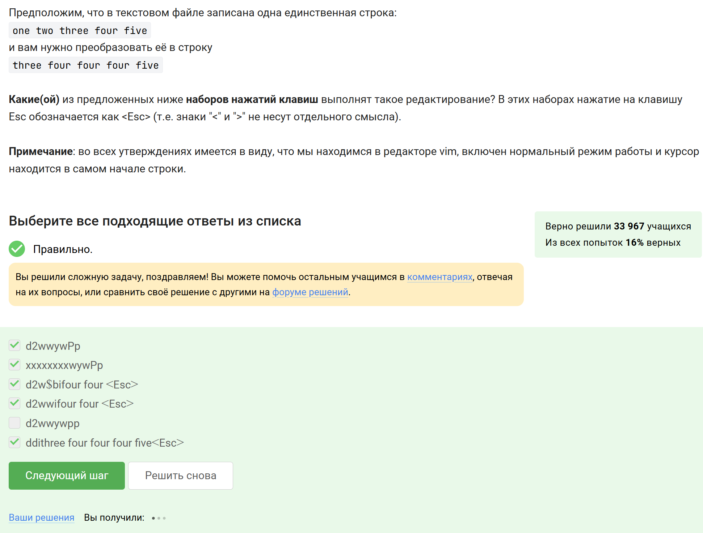

The task was about editing text in `vim` normal mode. I selected only the combinations that actually produce the required result using deletion, movement, and text insertion.

I entered the command `:%s/Windows/Linux` to replace, in the file, all lines containing the word `Windows` with corresponding lines containing `Linux`, replacing only the first occurrence in each line.

This task required using a substitution command in `vim`. The `%` range means the entire file, and the absence of the global replacement flag means that only the first matching word is replaced in each line.

I independently studied `vim` visual mode and selected the correct statements about how it works.

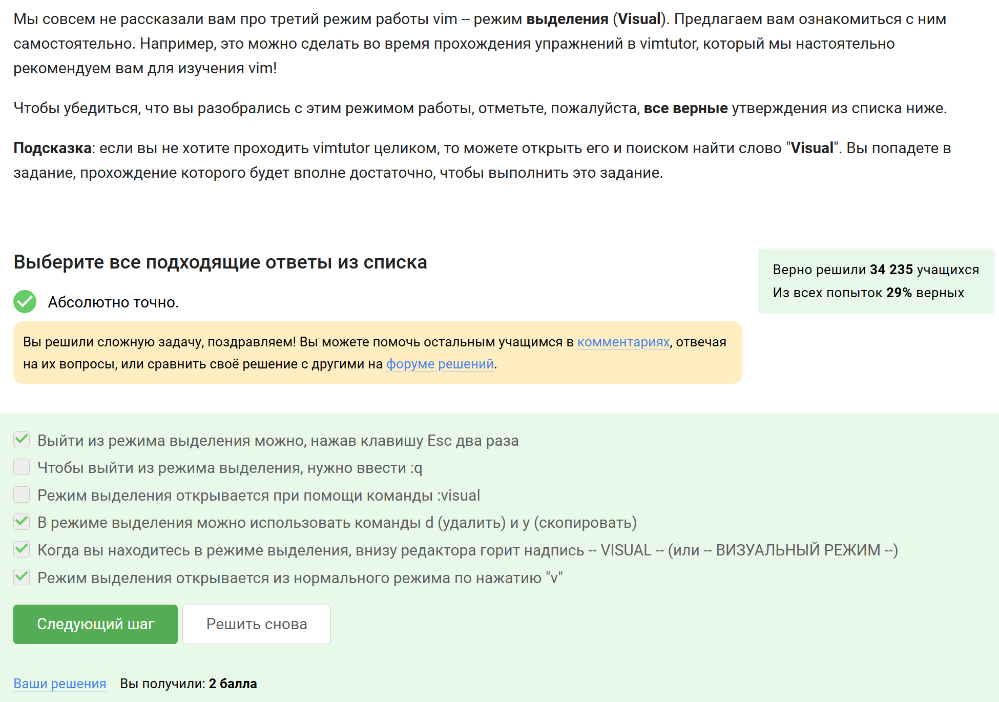

This task confirmed the main properties of selection mode: entering it with `v`, the ability to use delete and copy commands, and the display of the `-- VISUAL --` status line. I also noted that selection mode can be exited with `Esc`.

## Bash Scripts: Basics

I indicated that when moving through command history with the up and down arrows after launching several nested shells, only commands from the current shell are shown, that is, from set `C`.

Command history is stored separately for each active shell. Therefore, while working inside an inner shell, only the commands entered in that shell are available.

I determined that after executing the provided script, the file `file1.txt` will not exist, so the correct answer is "No way".

The script creates a file in `/home/bi`, but then changes to another directory. In the verification condition, the correct answer was that after the script finishes, the path to the file in the proposed form is not defined as the expected final answer.

I selected the valid variable names in `bash`: `_variable`, `VARiable`, and `variable123`.

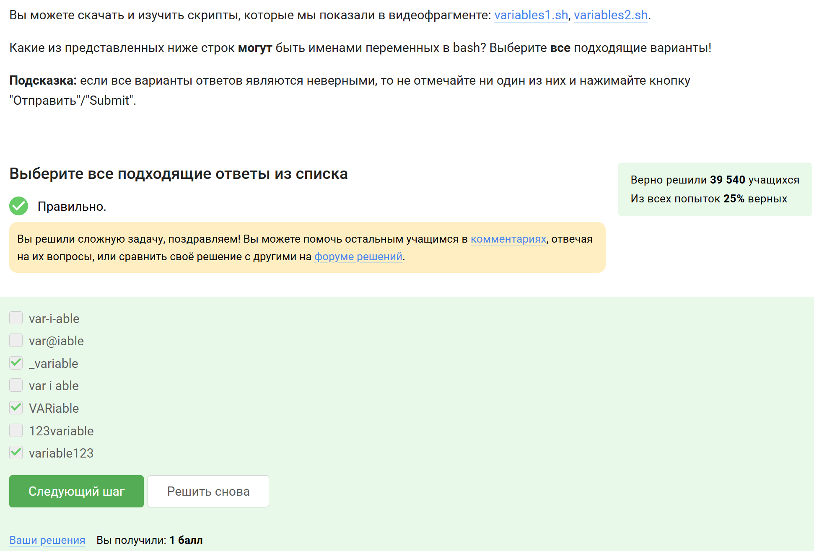

In `bash`, a variable name can contain letters, digits, and underscores, but it must not begin with a digit and must not contain spaces or special characters such as `-` and `@`.

I wrote a script that accepts two command-line arguments and prints them in the format `Arguments are: $1=... $2=...`.

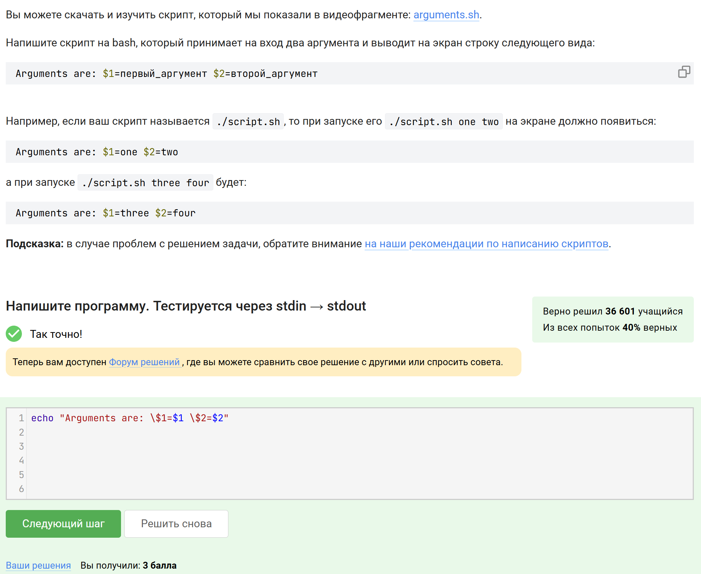

The solution used positional parameters `$1` and `$2`. It was also necessary to escape the `$` characters in the printed string so that they appeared as text on the left while the argument values were substituted on the right.

## Bash Scripts: Branching and Loops

In the task about conditional expressions, I selected only those options where the command `echo "True"` will always run, regardless of script launch parameters and variable values.

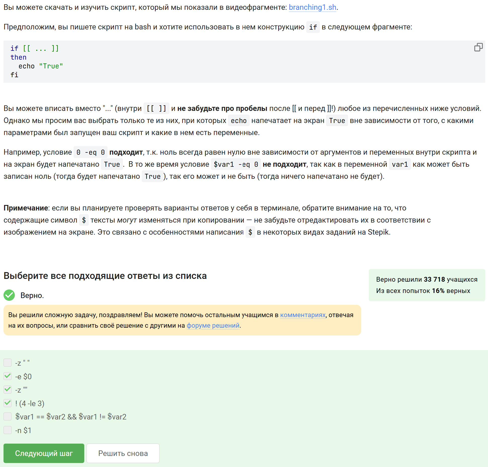

Here it was necessary to distinguish expressions that are always true from those whose result depends on script arguments, variables, or the existence of files. I selected only universally true conditions.

I determined that when the script fragment is run with `var=3` and then with `var=5`, the screen first prints `four`, and then again `four`.

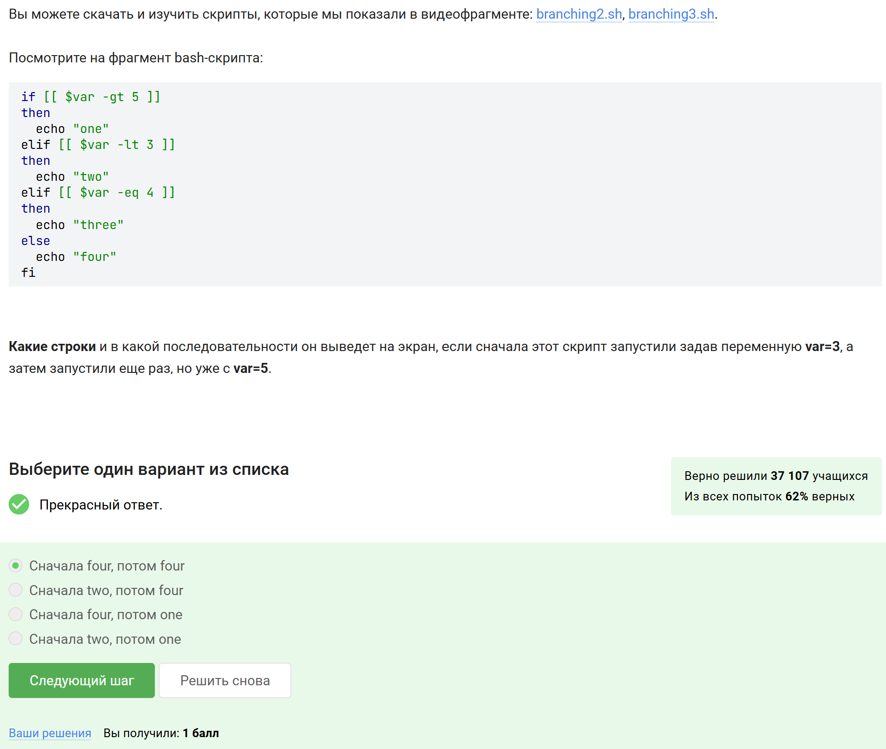

Conditions are checked from top to bottom. For values `3` and `5`, none of the `if` or `elif` conditions results in other output, so the `else` branch runs in both cases.

I wrote a script that prints one of the following strings depending on the number of students: `No students`, `1 student`, `2 students`, `3 students`, `4 students`, or `A lot of students`.

This task used a sequence of checks with `if`, `elif`, and `else`, allowing cases from `0` to `4` to be handled separately and all larger values to be assigned to one general category.

I indicated that in the given loop fragment, the word `start` is printed 5 times and the word `finish` is printed 4 times.

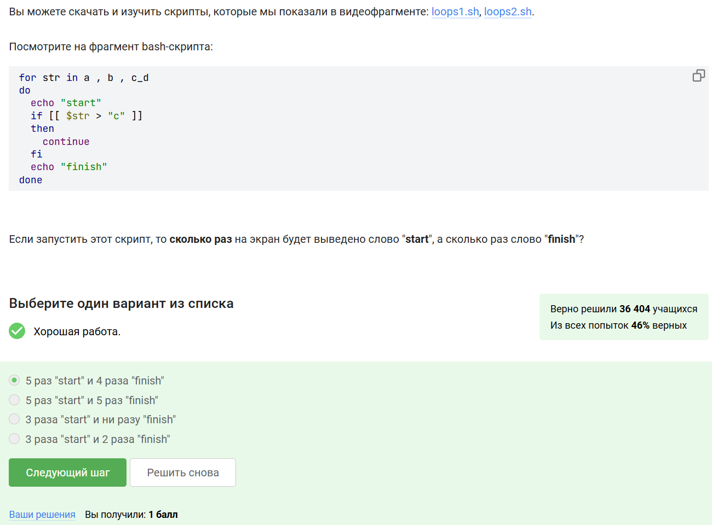

The command `echo "start"` runs on every loop iteration. After that, `continue` is triggered for one of the values, so the line `finish` is printed one time fewer.

I wrote an interactive script that asks for the user's name and age, determines the age group (`child`, `youth`, `adult`), and exits when the name is empty or the age is `0`.

The solution used `read`, conditional statements, and an infinite loop. After each valid input, the script repeats its work; when the exit condition is met, it prints `bye` and terminates.

## Bash Scripts: Miscellaneous

I selected all instructions that increase the value of variable `a` by the value of variable `b`.

The task checked understanding of the `let` syntax and the rules for evaluating arithmetic expressions in `bash`. I selected only the forms that really change variable `a` to the sum of its previous value and the value of `b`.

I determined that after changing to the `/home/bi/` directory, the command `echo "pwd"` prints the text `pwd` on the screen, not the current path.

In this case, the string is enclosed in quotation marks and passed to `echo` as ordinary text. Therefore, the `pwd` command is not executed; only its name is printed.

I indicated the correct ways to check the return code of an external program if it writes something to `stdout`.

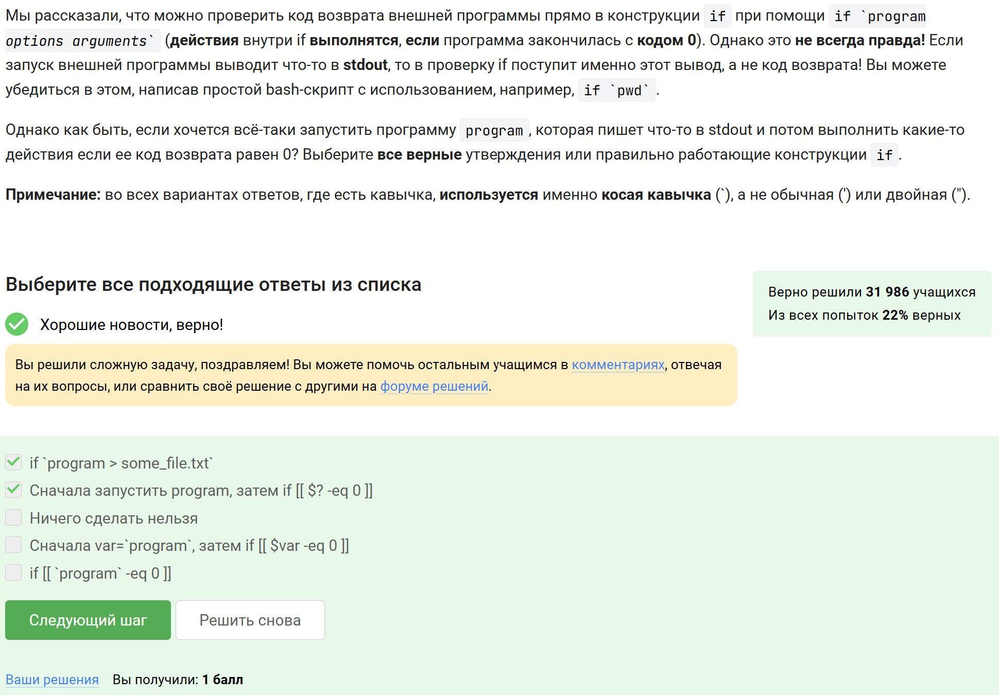

The task required understanding that a construct with backticks substitutes the text output, not the exit code. Therefore, the correct options are those with output redirection to a file followed by a check through `if`, and also launching the program and analyzing the `$?` variable.

I determined the result of ten calls to the `counter` function: the line printed by `echo` has the form `counters are  and 110`.

In this example, variable `c1` is declared local, so outside the function it remains empty. Variable `c2` is changed globally and accumulates the sum of doubled arguments, which gives the value `110`.

I wrote a recursive script for calculating the greatest common divisor of two numbers using Euclid's algorithm.

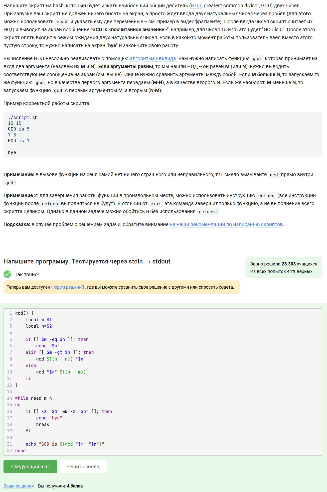

The script reads two numbers, calls the `gcd` function, prints the result in the format `GCD is ...`, and then waits for input again. When an empty line is entered, it correctly finishes with the message `bye`.

I wrote a calculator in `bash` that supports the operations `+`, `-`, `*`, `/`, `%`, `**`, exits on the `exit` command, and prints `error` for an invalid command.

The solution used reading lines from standard input, parsing arguments, and checking operation validity. The script performs calculations only for correctly formatted input.

## Advanced Search and Editing

I indicated that `find /home/bi -iname "star*"` will find the files `STARS.txt` and `Star_Wars.avi`, while `find /home/bi -name "star*"` will not.

The `-iname` option performs a case-insensitive search, while `-name` is case-sensitive. Therefore, files beginning with `Star` or `STARS` match only the first variant.

I selected the correct statements about the difference between the `find -path` and `find -name` options.

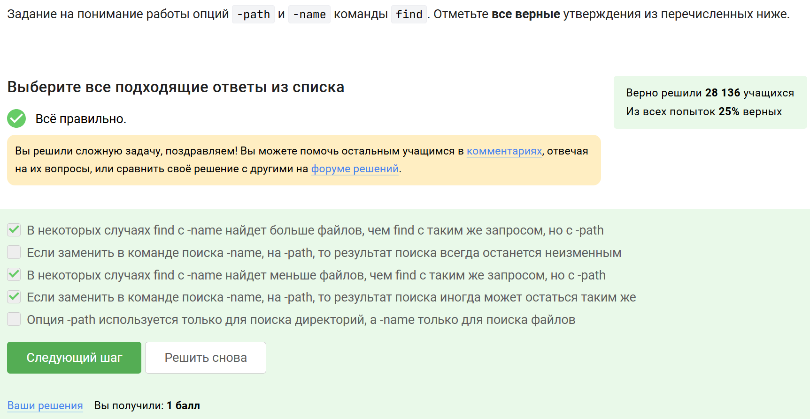

The `-name` option compares only the file or directory name, while `-path` compares the whole path. Therefore, in some cases `-name` may find more results, in others fewer, and sometimes the result can indeed be the same.

I determined that the command `find /home/bi -mindepth 2 -maxdepth 3 -name "file*"` will find all files except `file3`.

Search depth restrictions exclude objects that are too close to the search root or too deep. Therefore, `file3` does not fall into the required depth range.

I indicated that the largest size of `results.txt` will be produced by `grep -A 1`, `grep -B 1`, and `grep -C 1`, that is, by all variants except ordinary `grep "word"`.

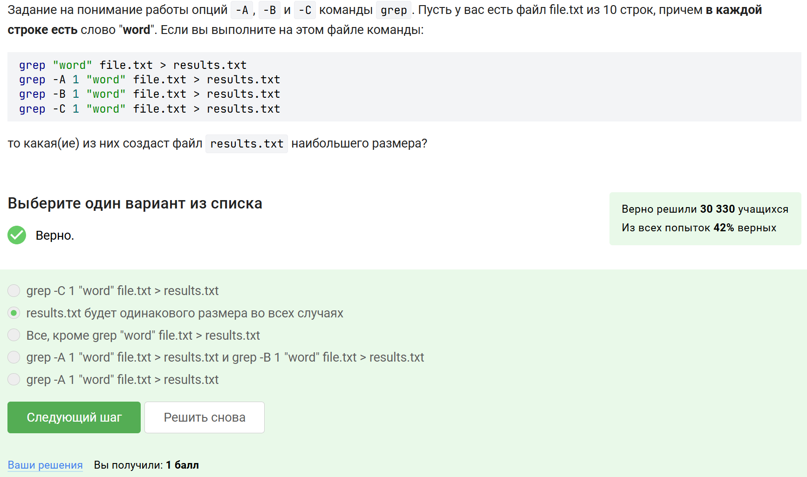

Because the word `word` appears in every line of the file, adding context causes all lines of the file to be printed. As a result, the file size for these three variants is the same and larger than for a simple search without context.

I selected the lines printed by the command `grep -E "[xkLXKL]?[uU]buntu$" text.txt`.

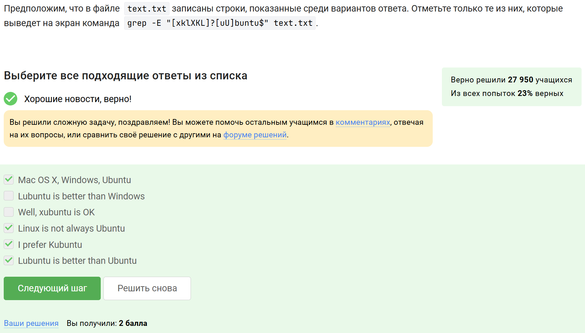

The regular expression allows an optional `x`, `k`, `X`, `K`, `L`, or `l` before the word `ubuntu` or `Ubuntu` at the end of the line. Therefore, I selected only the lines that satisfy exactly this pattern.

I indicated that if the `-n` option is not used in the command `sed -n "/[a-z]*/p" text.txt`, each line will be printed twice.

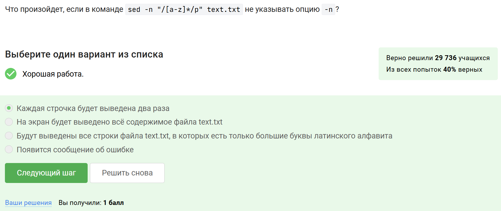

Without `-n`, `sed` already prints lines by default, and the `p` command prints them again. Therefore, the final output is duplicated.

I wrote a `sed` instruction that replaces all "abbreviations" made of uppercase Latin letters with the word `abbreviation` and writes the result to `edited.txt`.

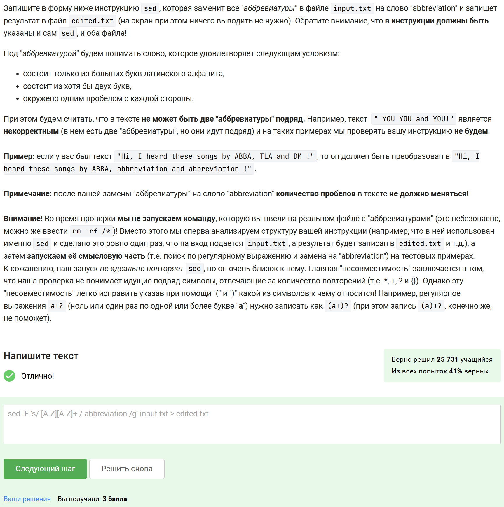

This task required correctly describing a regular expression for finding words of two or more uppercase letters surrounded by spaces, and performing the replacement while preserving the text structure and the number of spaces.

## Building Plots in gnuplot

I indicated that when launching `gnuplot`, the `-p` (`--persist`) option should be used to keep the plotted graphs after exiting the program.

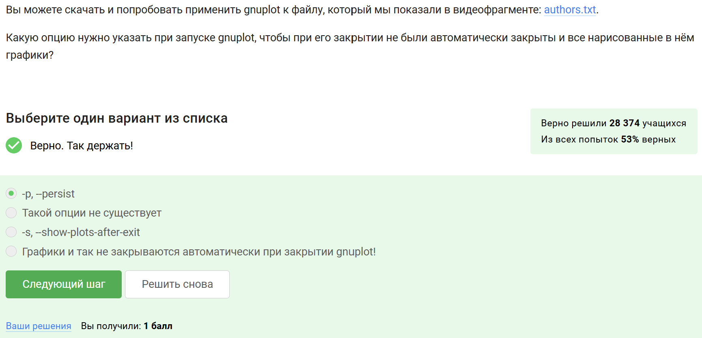

This option prevents graph windows from closing automatically after `gnuplot` finishes, which is convenient when viewing plotting results.

I determined that with the commands `set key autotitle columnhead` and `plot 'data.csv' using 1:2`, the data series name will become the first value from the second column, and 9 points will be drawn on the graph.

Because automatic labeling from the column header is enabled, `gnuplot` uses the first row of the file as the header. Therefore, that row is not used as a plotted point, leaving 9 data points.

I changed the `move.rot` file so that the graph was mirrored relative to the horizontal plane, started rotating in the opposite direction, and did so twice as fast.

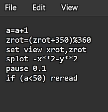

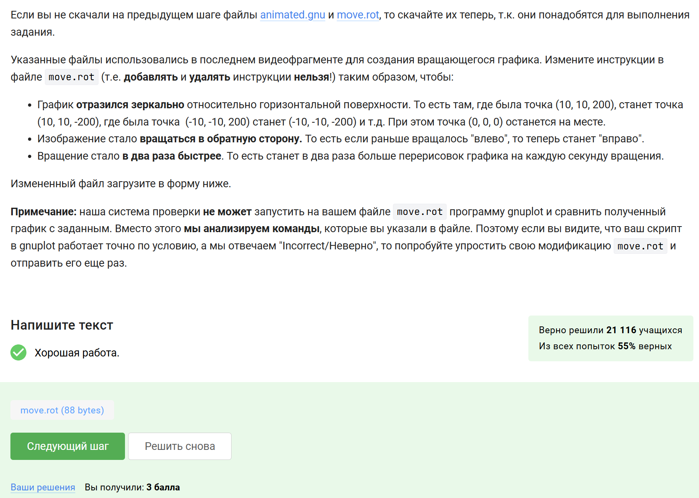

To solve the task, it was necessary to change only existing instructions in the file without adding or deleting lines. Mirroring the graph was achieved by changing the sign of the surface expression, reverse rotation by changing the direction of angle change, and increased speed by reducing the pause between redraws.

## Miscellaneous

I selected all commands that change the permissions of `file.txt` from `r--r--r--` to `rwxrw-r--`.

This required understanding both symbolic and numeric permission notation. I selected the correct variants both through sequential symbolic changes and through numeric mode `764`.

I indicated the commands after which the user `user` from group `group` will be able to create files in the directory `dir` created through `sudo`.

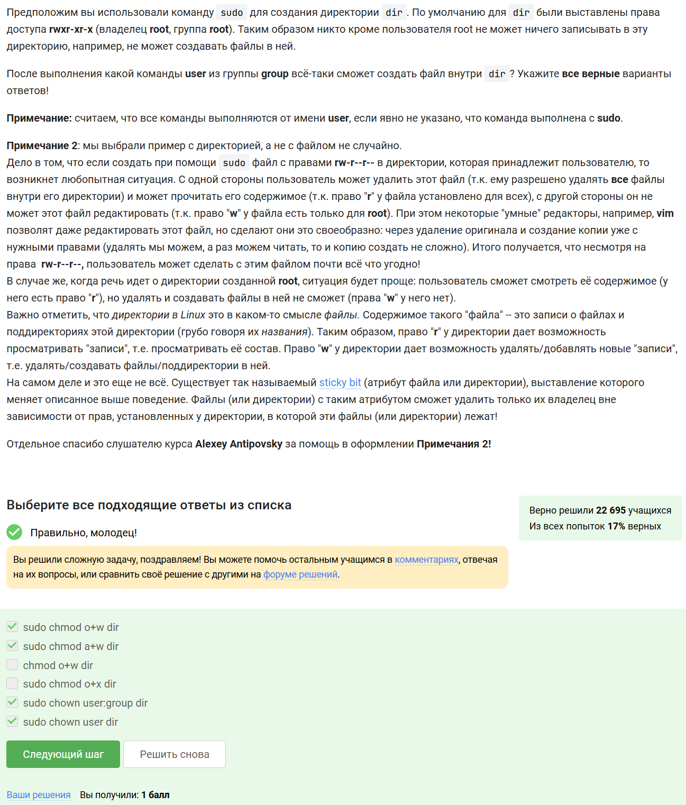

To create files inside a directory, write permission on the directory itself is required. Therefore, the correct commands are those that either grant write permission to other users or transfer ownership of the directory to the user.

I selected the file characteristics that can be counted with `wc`: the number of lines, words, and characters.

The `wc` command is designed specifically for counting lines, words, and characters or bytes. It does not directly count the number of sentences.

I entered the command that prints the size of the current directory in a human-readable format: `du -sh .`.

The solution used `du` with options for summary counting and human-readable formatting. This makes it possible to immediately obtain the total size of the directory.

I entered the shortest command for creating three directories `dir1`, `dir2`, and `dir3`: `mkdir dir{1..3}`.

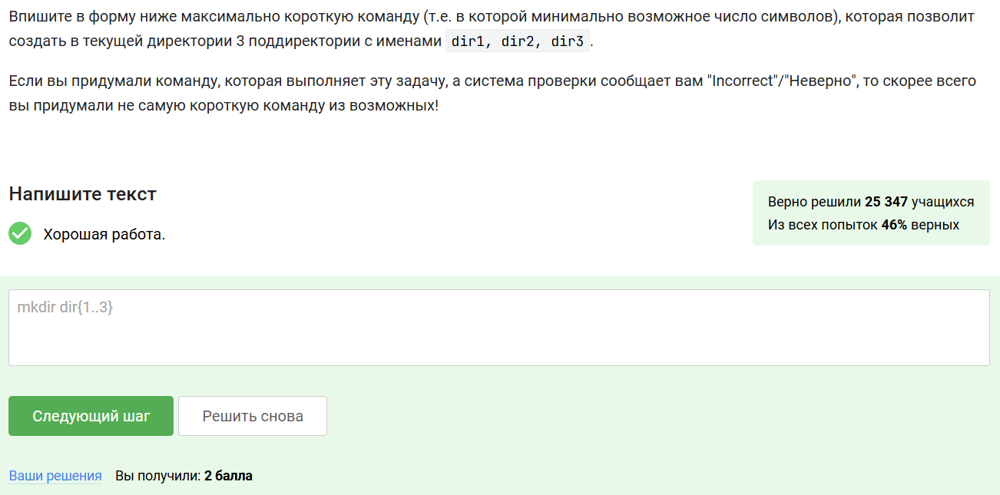

This task used brace expansion in the `bash` shell, which allows sequences of file and directory names to be written concisely.

# Conclusions

During the external course "Introduction to Linux", I consistently studied the main and advanced capabilities of working in a Linux environment. In the first stage, I mastered basic commands, working with files, input-output streams, archives, and search. In the second stage, I strengthened my skills in working with remote servers, file transfer, processes, multithreading, and `tmux`. In the third stage, I studied the `vim` editor, writing `bash` scripts, text processing, search, plotting, and access permission management.

As a result of completing all stages, I gained practical skills needed for confident Linux work, automation of typical tasks, and further study of system administration and command-line tools.
